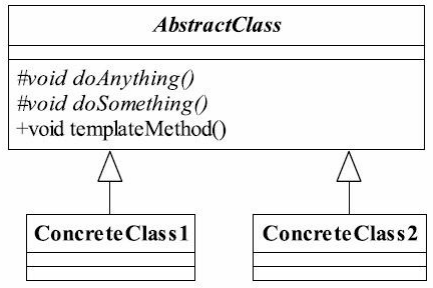

## 模版模式(Template Pattern)

> **使用一个抽象类对其他类的方法进行封装,抽象类的子类可以按需求重写这些方法来对原有类逻辑进行改变**
>
> **将一些通用方法延迟到其子类中实现,使子类方法在不改变约束条件下重写这些通用方法**
>
> **模版方法的使用场景**
>
> - 多个子类有公有方法,且逻辑基本相同
> - 重要,复杂的算法设计模版方法
> - 模版方法重构,将相同的代码抽取到父类中,通过构造函数约束行为
>
>  
>
> AbstractClass 抽象模版
>
> - 基本方法(子类实现)
> - 模版方法(不允许复写)
> - 钩子方法(子类通过钩子方法更改模版方法逻辑)
>
> **模版方法扩展类**
>
> 钩子方法(Hook Method) :**外界条件改变**,**影响到模版方法的执行**
>
> *模版方法模式在模版方法中按照一定的规则和`顺序调用基本方法*
>
> 

