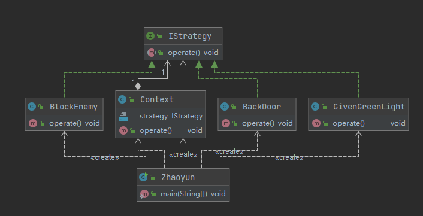
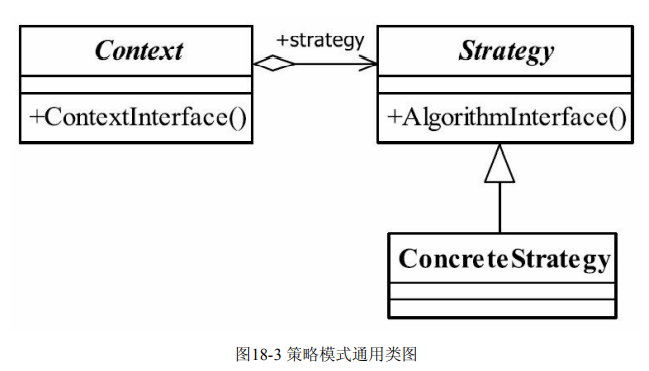
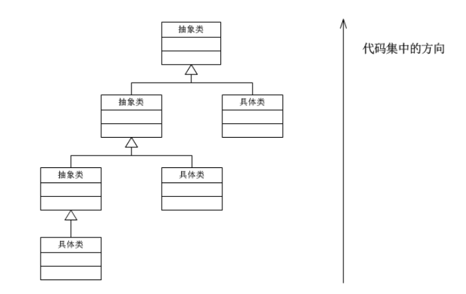

## 策略模式(Strategy Pattern)

> **定义一组算法,将每个算法都封装起来,并且它们之间可以相互转换**
>
> *一个类的行为或算法可以在运行的时候更改,解决编译使用if-else方法代替逻辑判断*
>
>  
>
>  
>
> - Context 封装角色
>
> > 抽象创造算法的直接访问,封装可能存在的变化
>
> - Strategy抽象策略角色
>
> > 策略算法家族的抽象,定义每个策略或算法必须具有的方法和属性2
>
> - ConcreateStrategy具体策略角色
>
> > 具体实现的操作
>
> **采用面向对象的继承和多态机制**
>
> **策略模式优点**
>
> - 算法策略可以自由切换
> - 避免使用多重条件判断
> - 扩展性号
>
>  
>
> 
>
> 