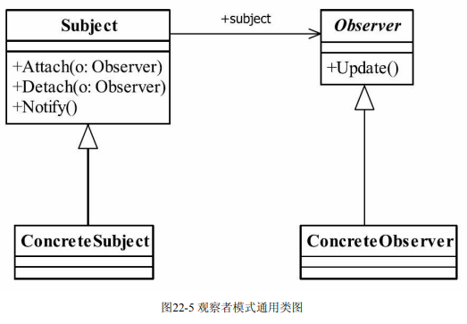
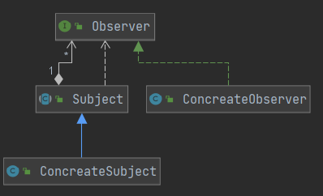
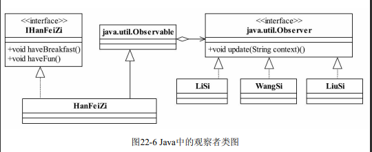

## 观察者模式(Observer Pattern)

> 观察者模式也叫做发布订阅模式(Publish/subscribe)
>
> **定义对象间一种一对多的依赖关系,使得每个对象改变状态时,依赖于它的对象都会得到通知并且自动更新**
>
>  
>
> - **Subject 被观察者**
>
> > 定义被观察者必须实现的职责，它必须能够动态地增加、取消观察者。它一般是抽象类 或者是实现类，仅仅完成作为被观察者必须实现的职责：管理观察者并通知观察者
>
> - **Observer 观察者**
>
> > 观察者接收到消息后,进行相应业务处理(依赖被观察者而改变)
>
> - **ConcreateSubject 被观察的具体对象**
>
> > 定义被观察者事件通知
>
> - **ConcreateObserver 具体的观察者**
>
> > 处理被观察者事件
>
>  
>
> #### **观察者模式的应用**
>
> > - 实现观察者与被观察者之间抽象耦合
> > - 实现对象之间触发机制
> >
> > - 多个观察者之间顺序无法确定
> > - 存在广播链问题(A->B->C) 即为观察者本身也被观察
> > - 多个观察者执行时间长,使用异步代替 **(Message Queue)**
> > - **观察者响应方式(采用多线程处理,使用缓存技术)**  **异步使用多线程  同步使用缓存**
>
> #### **观察者模式实践**
>
> > - 文件系统检测
> > - ATM取钱
> > - 广播收音机
>
> #### **Java中观察者模式**
>
> >  
> >
> > ~~~java
> >
> > 
> > /**
> >  * 基于Java 接口实现被观察者
> >  * @link 原文链接：https://blog.csdn.net/u012250875/article/details/77747878
> >  *
> >  */
> > public class Clown extends Observable {
> >     /**
> >      * 表演的精彩
> >      */
> >     public static final int PERFORM_GOOD = 0;
> >     /**
> >      * 表演的糟糕
> >      */
> >     public static final int PERFORM_BAD = 1;
> >     /**
> >      * 表演完毕
> >      */
> >     public static final int PERFORM_COMPLETE = 2;
> > 
> > 
> >     /**
> >      * 表演
> >      */
> >     public void perform() {
> >         System.out.println("**小丑开始表演**");
> > 
> >         int random = new Random().nextInt(2);
> >         //小丑表演状态是随机值，0表演的好，1表演的差
> >         switch (random) {
> >             case PERFORM_GOOD:
> >                 System.out.println("**小丑状态很好，表演的很精彩！**");
> >                 break;
> >             case PERFORM_BAD:
> >                 System.out.println("**小丑状态不好，出了点篓子！**");
> >                 break;
> >         }
> >         // 改变
> >         super.setChanged();
> >         //通知信息
> >         super.notifyObservers(random);
> >     }
> > 
> >     /**
> >      * 表演结束,小丑退场
> >      */
> >     public void exit() {
> >         System.out.println("**表演结束，小丑退场！**");
> >         super.setChanged();
> >         //退场消息通过该参数传递到观众的update方法的第二个参数上
> >         super.notifyObservers(PERFORM_COMPLETE);
> >     }
> > 
> > }
> > 
> > ~~~
> >
> > 

