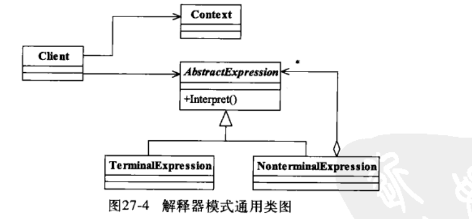

## 解释器模式(Interpreter Pattern)

> 给定一个语言,定义它的文法表示,并定义一个解释器,解释器用来标识该语言中特殊含义.
>
> - 应用
>
> > - 编译器
> > - 算法表达式计算
> > - 模型运算
>
>  
>
> - AbstractExpress 抽象解释器
>
> > 具体的解释任务子类实现
>
> - TerminalExpress 终结符表达式
>
> > 变量表达(最终结果类型)
>
> - NonterminalExpress 非终结表达式
>
> > 逻辑运算
>
> - Context 环境角色
>
> > 容器(Map)
>
> 
>
>  
>
>  
>
> > ~~~java
> > public class Calculator {
>     //定义表达式
>     private Expression expression;
>     public Calculator(String expStr) {
>         Stack<Expression> stack = new Stack<>();
>         char[] charArray = expStr.toCharArray();
>         //运算
>         Expression left = null;
>         Expression rigth = null;
>         // 后缀表达式运算
>         for (int i = 0; i < charArray.length; i++) {
>             switch (charArray[i]) {
>                 case '+':
>                     left = stack.pop();
>                     rigth = new VarExpression(String.valueOf(charArray[++i]));
>                     stack.push(new AddExpression(left, rigth));
>                     break;
>                 case '-':
>                     left = stack.pop();
>                     rigth=new VarExpression(String.valueOf(charArray[++i]));
>                     stack.push(new SubExpression(left,rigth));
>                     break;
>                 default:
>                     stack.push(new VarExpression(String.valueOf(charArray[i])));
>             }
>         }
>         this.expression = stack.pop();
>     }
>     //开始运算
>     public int run(Map<String, Integer> var) {
>         return this.expression.interpreter(var);
>     }
> }
> 
> ~~~
>
> 
>
> 