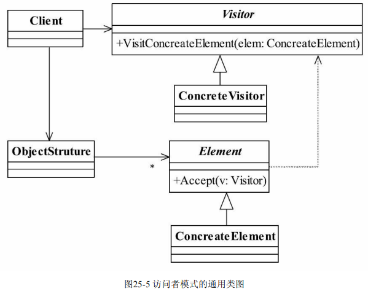
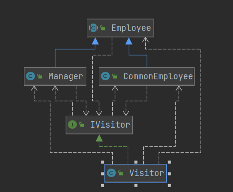

## 访问者模式(Visitor Pattern)

> **元素执行的算法可以根据访问者变化而变化(对象的入参决定对象行为)**
>
> - **将数据结构与数据行为分离**
> - 在被访问类中加一个对外提供接待访问者的接口
> - 在数据基础类中定义一个访问者,访问者不同执行不同逻辑
>
>  
>
> - **Visitor  抽象访问者**
>
> > 通过接口约束访问的对象(声明访问者者可以访问的元素)
>
> - **ConcreateVisitor 访问对象**
>
> > 实现访问者逻辑(通过重载代替if)定义不同的访问对象
>
> - **Element 抽象元素**
>
> > 被访问的一组抽象元素
>
> - **ConcreateElement 具体元素**
>
> > 被访问的具体元素
>
> - **ObjectStruture 结构对象**
>
> > 元素产生者，一般容纳在多个不同类、不同接口的容器，如List、Set、Map等，在项目 中，
>
>  
>
> 
>
> 

