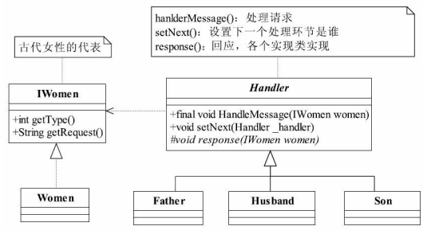
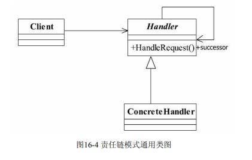
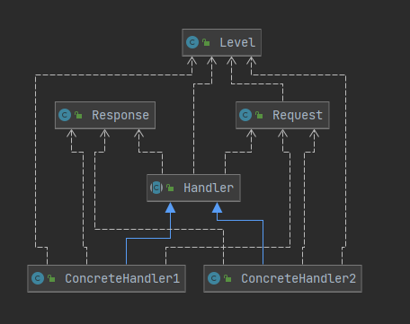

## 责任链模式(Chain of Responsibility Pattern)

> 为请求创建一个接收者对象链,对请求发送者和接收者进行解耦
>
> 职责链上的处理者负责处理请求，**客户只需要将请求发送到职责链上即可，无须关心请求的处理细节和请求的传递(逻辑判断)**，所以职责链将请求的发送者和请求的处理者解耦了。
>
>  
>
>  
>
>  
>
> #### **责任链模式应用**
>
> - 将请求和处理分开,请求者可以不用知道谁处理
>
> 

