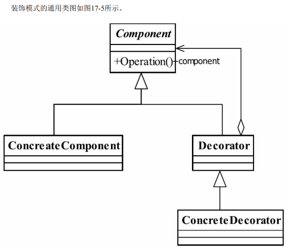

## 装饰模式

> 动态地给一个对象添加一些__额外的职责__(特殊的代理类)
>
> - __装饰者与被装饰者无任何依赖关联__
> - 装饰者时继承关系的替代方案(is-a 组合关系,代理模式)
> - 装饰者可以动态扩展一个实现类功能
>
>  
>
> - Component抽象构件(接口/抽象类)
> - ConcreateComponent 具体构件(抽象构件实现类)
> - Decorator 装饰角色
> - ConcreateDecorator 具体装饰角色
>
> > Component与Decorator 聚合=>CocreateComponent(实现具体逻辑)
> >
> > Decorator=>子类装饰CocreateComponent(依赖于Component,子类调用父类方法)
>
>   
>
> 

