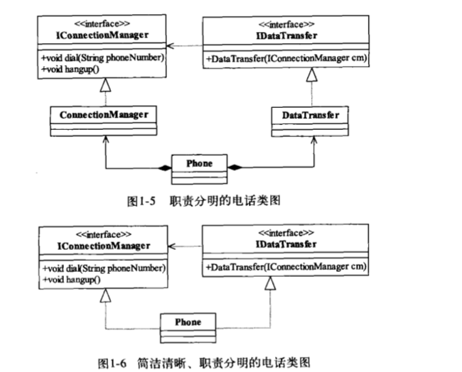

## 设计原则

#### 单一职责原则(Single Responsibility Principle)

> _There should never be more than one reason for a class to change_
>
> 单一职责原则__要求一个接口或者类只有一个原因引起变化__(一个接口或一个类负责一个功能)
>
> - 类的复杂性降低,实现职责有明确定义
> - 可读性高,复杂性降低
> - 维护成本高
> - 更改引起的风险降低
>
>  

#### 里氏替换原则(LiskovSubstitution Principle LSP)

> 继承带来的优点与缺点
>
> > - 代码共享,减少类的创建,提高代码的重用性
> > - 提高代码的可扩展性
> > - 继承存在代码侵入(子类拥有父类的所有方法)
> > - 降低代码灵活性(存在父类约束)
> > - 增强耦合性,父类更改需要考虑子类的变动
>
> 定义
>
> > 存在类型S的对象$s_1$,类型T的对象$t_1$, 使得以T定义所有的对象$t_1 都替换成 s_1$时,程序的逻辑没有发生变化,那么类型S是类型T的子类型(__所有引用基类的地方必须透明的使用其子类的对象__)
>
> - 子类必须完全实现父类的方法(类中调用其他类时,务必使用父类或接口)
>
>    
>
> - 子类可以自定义行为(子类不能代替父类出现)
>
> - 覆盖或者实现父类的方法输入参数时可以被放大(__不同类中重载__)
>
>   > ~~~java
>   > public class Father{
>   >   public Collection doSomething(HashMap map){
>   >     doSomething....;
>   >   }
>   > }
>   > 
>   > public class Son extends Father{
>   >   public Collection doSomething(Map map){
>   >     doSomething...;
>   >   }
>   > }
>   > ~~~
>   >
>   > __参数放大__,使用重载方式调用父类方法(子类方法永远不会执行)
>   >
>   > __子类方法中的前置条件必须与超类中被覆写的方法前置条件相同或者更宽松__
>
> - 覆写或实现父类的方法输出结果时可以被缩小
>
> > 子类重载或覆写父类方法,其__返回值必须一致或父类实现的子类__

