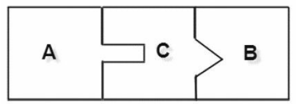

## 适配器模式

> 将一个类的接口转变成客户端期待的另一种接口,使其原本接口不匹配而无法实现的两个类能够实现
>
> - 将两个没有任何关系的类联系在一起(代替执行)
> - 灵活性高
> - 提高类复用度
>
>   __A和B之间加上适配器C__
>
> __适配器通用模式__
>
>  
>
>  
>
> - Target 目标角色
>
> > 待转换类
>
> - Adaptee 源角色
>
> > 被转换类
>
> - Adapter适配器角色
>
>   > 转换类
>
>  
>
> ####  适配器模式扩展(适配多个类合成一个目标类) 
>
> > _将多个Adaptee关联到一个适配器中_
>
>  
>
> 

