## 软件工程

> 软件：程序+数据+文档
>
> 1. 软件：完成预定功能的可执行指令序列
> 2. 数据：程序能处理的信息
> 3. 文档：开发，使用和维护程序相关的资料
>
> 软件工程要素：过程+方法+工具
>
> 1. 方法：完成软件各项任务的技术方法
> 1. 工具：支持方法的环境
> 1. 过程：获得高质量软件需要完成的一系列任务框架
>
> 软件周期：
>
> 1. 定义：问题定义，可行性分析，需求分析
> 2. 开发：概要设计，详细设计，编码和测试
> 3. 维护：运行与维护
>
> 可行性分析任务：短时间内以最小的代价判断问题是否能解决
>
> 可行性研究：从技术，经济及社会环境论证软件的可行性
>
> - 技术可行性：在现有资源（软硬件，技术人员水平）下满足待开发软件的功能，性能
> - 经济可行性：开发成本与预期收益
> - 社会可行性：法律约束
>
> **软件过程模型**
>
> 1. 瀑布模型：将软件划分为一系列阶段，每个阶段都依赖于前一个阶段的完成，每个阶段只进行一次，适用于需求明确且稳定的项目（项目规模较小，复杂度低），强调文档化：每个阶段完成后都有详细的文档记录，方便后期维护和追溯。不适应需求变更，忽视用户反馈。
> 2. 原型模型：快速构建一个系统原型来收集和细化用户的需求和反馈，适合系统要求不明确或复杂的项目，有效降低风险，增强沟通，资源消耗，处理复杂业务存在局限性。
> 3. 迭代式开发：将整个软件划分多个短周期，在每个迭代中需要完成需求分析、设计、实现、测试和评审
>    - 螺旋：瀑布，迭代，原型的结合，加入风险评估，适用大型复杂项目（复杂，成本高，时间不确定，需求变更困难）
>    - 增量：每个增量阶段都提供一个可运行的产品版本。加入优先级管理，增量之间存在依赖，影响增量的发布，增量模式适用于需求不明确、易变或者项目周期较长的情况
>    - 敏捷：灵活度高，强调高效沟通，快速反馈

#### 软件需求与规约 SRS

> 软件需求与规约：定义了软件系统的功能和非功能需求。描述了软件的预期行为、与其他系统的交互，以及对用户和利益相关者的期望，主要目的是向开发团队传达需求，验证和验证提供基准，降低项目风险，用户和开发建立共识。
>
> 需求基本性质：必要，无歧义，可测试，可跟踪，可测量
>
> 需求分类：功能需求，非功能需求（接口，设计约束，质量属性）
>
> 需求发现方法：交谈，自创，观察，小组会讨论，提炼
>
> 需求规格说明书：
>
> 1. 目的和范围（背景，业务需求，利益，期望）
> 2. 分析（市场分析，客户调研，竞争对手分析，技术评估）
> 3. 定义（功能，约束条件）
> 4. 管理（需求变更记录，版本管控，项目计划，流程跟踪）
> 5. 验证（验证技术与方法，可交付成果审查，用户验收测试）
> 6. 附录（材料证明，相关人员联系方式，技术规格清单，财务记录）

#### 结构化方法

> **结构化方法：**用于系统收集、分析和记录软件系统的需求。有助于确保需求的完整性、一致性和可验证性
>
> - **结构化分析和设计技术（SADT）**：用于分解复杂系统并识别其组成部分及其交互
>   
>   1. 确定分析边界与目标
>   2. 绘制顶级活动框，表示系统整体目的
>   3. 分解顶级活动
>   4. 识别活动输入与输出数据
>   5. 识别活动机制与约束条件
>   6. 连接活动显示数据或控制流
>   
>   
>   
> - **数据流图（DFD）**：以图形方式表示数据在系统内流动的方式（数据源、处理过程和数据接收器），表达系统功能之间的逻辑关系
>
>   1. 实体：系统外部的实体，与系统交换信息（矩形表示）
>   1. 过程：对数据执行转换的活动（椭圆表示）
>   1. 数据流：在实体、过程和存储之间流动的信息（带方向的箭头）
>   1. 数据存储：用于存储数据的实体（静态数据)（双下滑线）
>   1. 层次数据流图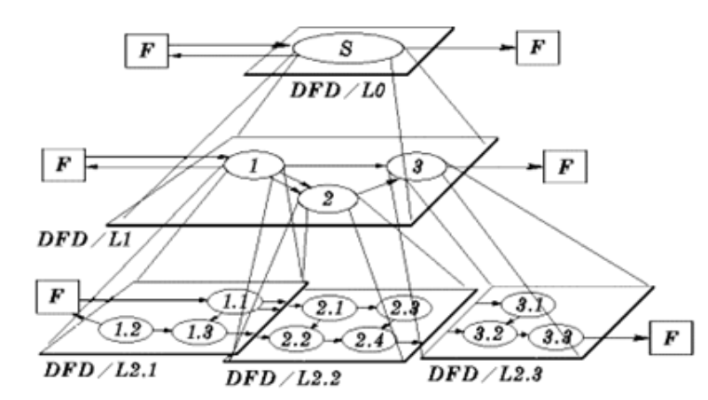 
>   1. 校验流程图方法：输入流与输出流相等，无遗漏或重复的元素
>   
>   
> - **数据字典**：描述系统中所有数据的详细定义
>
>   - `=`：定义为
>
>   - `+`：顺序
>
>   - `|`：或者，选择
>
>   - `{}`:重复
>
>   - m..n：可取 m~n 中的任意值
>
> - **数据加工描述**
>
>   - 结构化语言：IF-THEN-ELSE-ENDIF，CASE-OF-ENDCASE，DO-WHILE-ENDDO，
>
>   - 判定表：表头列出所有的条件组合，单元格显示操作内容 
>
>     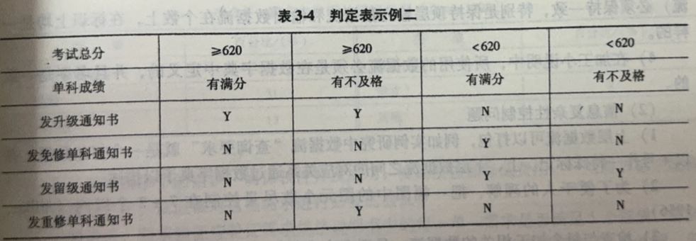 
>
>
>   - 判定树：
>
>     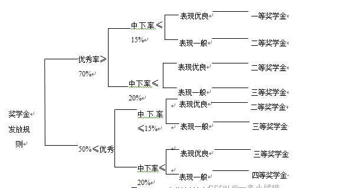 
>
> 
>
> 
>
> **总体设计任务** ：定义系统整体架构和主要组件，确定系统功能和性能要求，指定系统接口和通信协议，规划系统数据结构、流和存储。
>
> **总体设计目标**：明确系统范围和约束，定义系统边界、限制和关键假设，设计一个可扩展、灵活且可维护的系统架构，遵循已建立的标准和指导方针，确保系统的质量和兼容性。
>
> **总体设计方法**：分解系统为可管理的模块，确定模块之间的接口和依赖关系
>
> 总体设计表达：
>
> - 蓝图（模块化结构）：描述系统及其组件的总体结构和行为，重点关注系统的主要功能和交互
> - 层次图：图形表示，展示系统组件及其层次关系
> - HIOP：描述系统组件之间的交互和数据流（以输入，输出，处理分类实体，并用箭头指明数据流向）
>
> 总体设计步骤：任何复杂的DFD都可以转为以下基本类型
>
> - 变换型数据流图（TDF）：外部数据经过物理输入转为系统数据，再由系统物理输出为用户使用的数据
>   - 物理输入：当前实体从外部系统获取（未转换过的数据）
>   - 逻辑输入：由系统内部转换接收的数据
> - 事务型数据流程图：描述数据加工的方式
>   1. 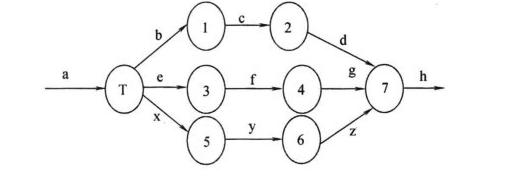 
>   2. 数据流a输入到处理节点T后，由T选定该数据在那一条路径上转换
>
> 
>
> **模块化设计**：将软件划分若干个高内聚低耦合的模块
>
> - 耦合关系（模块之间依赖关系）：引用，数据传递，控制传递
>
>   1. 内容
>   2. 公共
>   3. 控制
>   4. 标记（间接）
>   5. 数据
>
> - 内聚（模块内部依赖关系）：
>
>   1. 功能
>   2. 顺序（先后处理）
>   3. 通信（数据关联）
>   4. 过程
>   5. 时间
>   6. 逻辑
>   7. 偶然内聚
>
> 
>
> **详细设计**：将总体设计阶段产生的系统高层结构转为系统最终结构
>
> - 结构化程序设计：顺序，选择，循环
> - 设计工具：
>   - 程序流程图：使用顺序，选择结构，循环结构方式表示算法或流程的图形（不利于全局设计，无法表示数据结构）
>   - 盒图（N-S）
>     - 顺序：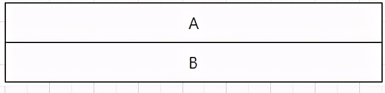 
>     - 选择：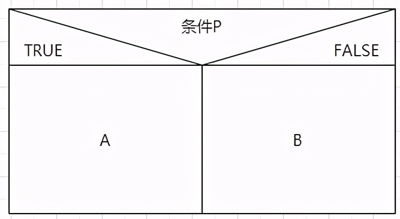 
>     - 循环：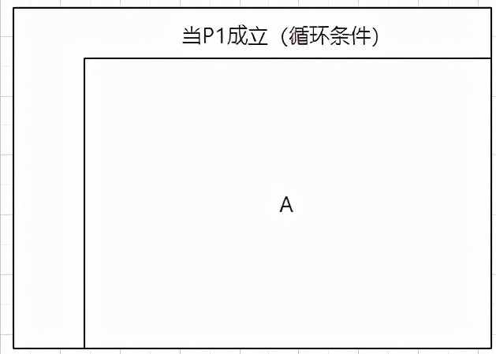 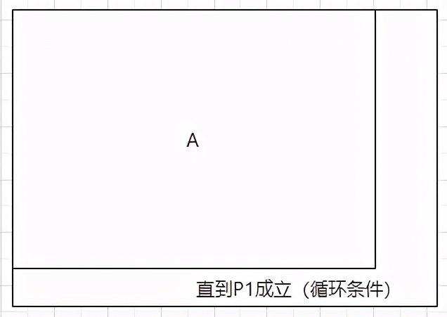 
>   - PAD图
>     - 顺序：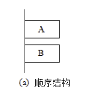 
>     - 选择：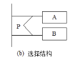 
>     - 循环：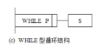 
>     - UNTIL：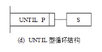 
>     - 定义：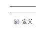 
>   - 伪码（PDL）：使用人类语言表达程序
>

#### 面向对象方法

> **UML**：统一建模语言，用于可视化、规范和记录面向对象系统的一种图形语言
>
> - 描述关系
>
>   1. 关联（Association）：对象中含有其他对象属性。实线+箭头
>   2. 聚合（Aggregation）：特殊的关联关系，关联实体之间不在同一生命周期中，可以由方法注入。实线+空菱形
>   3. 依赖（Dependency）：临时关联（局部变量，入参，出参）。虚线+箭头
>   4. 组合（Component）：特殊的关联关系，关联实体在同一生命周期中。实线+实心菱形
>   5. 实现（Realization）：实现关系。虚线+空三角形
>   6. 泛化（Generaliztion）：继承关系。实线+空三角形
>
> - 表达事物术语
>
>   1. 类与对象
>   2. 接口
>   3. 协作
>   4. 用况
>   5. 主动类：没有外部输入的情况下自动执行操作的类（用于表示并发行为）
>   6. 构件：
>   7. 制品
>
> - 类图：表示静态结构模型（类，接口，关联，泛化和依赖）
>
> - 用例图：描述系统功能需求，表达用户与系统之间交互的序列。
>
> - 状态图：描述系统或对象在不同状态下的行为
>
>   1. 状态：系统或对象在特定时间内的行为（圆角矩形表示）
>   2. 过渡：通过特定事件（信号）使状态转换
>
> - 时序图：用于表示一段时间内发生的事件序
>
>   1. 消息：同步（带箭头实线），异步（带箭头带箭尾实线），延迟阻塞（直线），回复消息（虚线）
>   2. 对象生命线：对象存在周期，其中矩形表示在指定时间段处于激活状态
>   3. 控制操作
>
>   
>
> **RUP：**统一过程，软件开发过程框架，提供了项目管理和软件开发的方法论（基于迭代和增量开发方法，通过需求驱动开发，定义项目中角色与其对应的活动）
>
> - 以需求为驱动
>
> - 以体系结构为中心（软件开发过程划分为多个阶段，并在每个阶段提供了一系列的最佳实践和指导）
>
> - 迭代，增量式开发
>
> - 核心工作流程
>
>   1. 需求获取
>
>      - 业务需求文档中获取候选需求
>      - 业务对象建模
>      - 转为系统功能需求（创建用例，排优先级，细化用例，创建用户界面原型）
>
>      - 用例模型结构化（用例之间关系分类）
>      - 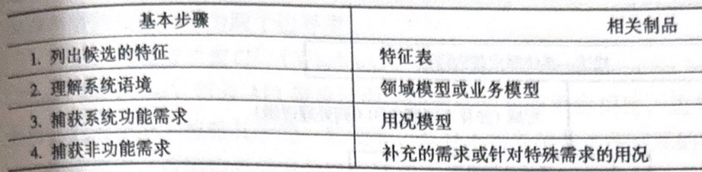 
>      - 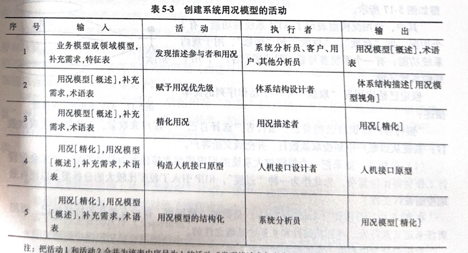  
>
>   2. 需求分析
>
>      - 分析类：定义业务行为，忽略其具体特征。
>        - 边界：定义参与者与系统的约束
>        - 实体：定义长期在系统的行为
>        - 控制：定义边界与实体状态变换
>      - 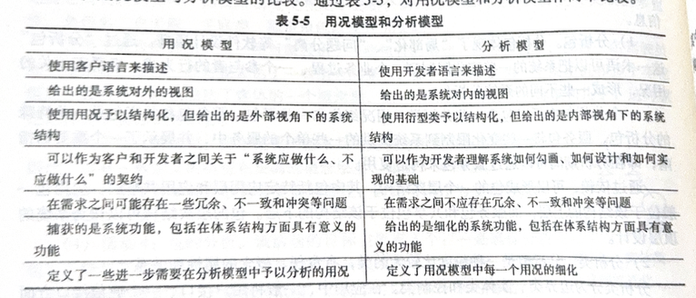 
>
>   3. 设计
>
>      - 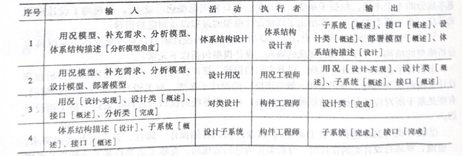 
>
>   4. 实现
>
>      - 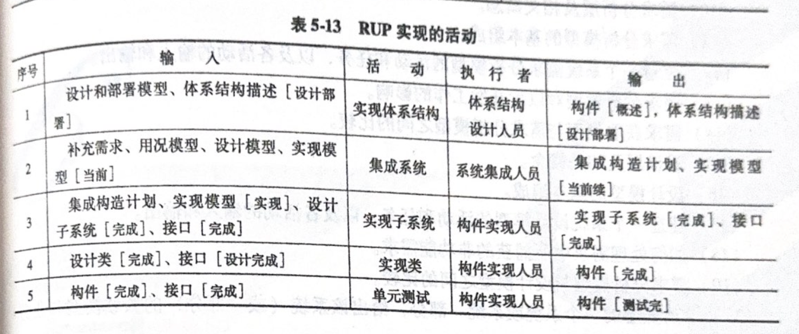   
>
>   5. 测试
>
>      - 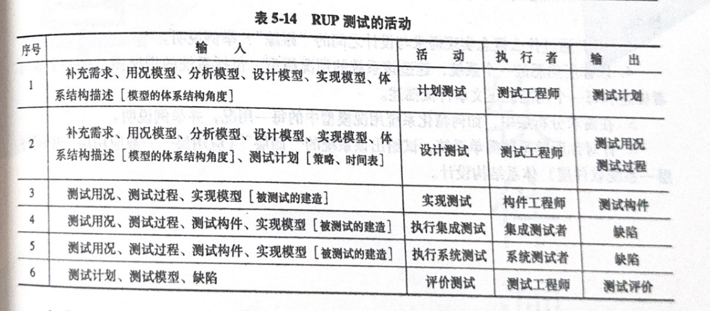 
>
>      
>
> 
>
> 