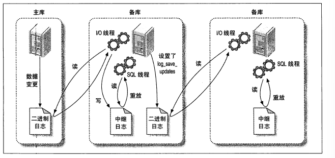

## MYSQL主从复制

> 1. 主库上把数据更改记录存放BinLog日志
> 2. 备库将主库上的日志复制到自己中继日志(Relay Log)
> 3. 备库中读取中继日志中**事件**，将数据存放到备库上
>
>  
>
> *备库启动I/O线程，I/O线程与主库建立客户端连接，主库上开启一个二进制存储线程，通过**事件方式通知方式**读取二进制文件*   异步进行
>
> **MYSQL主从复制步骤**
>
> > - 主从复制服务器操作系统与数据库版本一致
> > - **主从复制中数据一致**
> > - 主库开启二进制日志 server_id 不同
> >
> > ~~~sql
> > -- 创建复制账号及授权
> > CREATE USER 'repl'@'192.168.199.198' IDENTIFIED WITH mysql_native_password BY 'Ron_master_1';
> > GRANT REPLICATION SLAVE ON *.* TO 'repl'@'192.168.199.198';
> > -- 刷新权限
> > flush privileges;
> > -- 获取主节点binlog 文件名及偏移量
> > show master status;
> > -- 在从库上设置主库连接参数及binlog配置
> > CHANGE MASTER TO MASTER_HOST='192.168.199.149',MASTER_USER='repl',MASTER_PASSWORD='Ron_master_1',
> > MASTER_LOG_FILE='binlog.000006',MASTER_LOG_POS=856;
> > -- 开启主从同步
> > start slave;
> > -- 查看主从同步状态
> >  show slave status\G;
> > -- 重新配置主库信息
> >  reset slave;
> >  -- 重置主库binlog日志
> >  RESET MASTER;
> > ~~~
> >
> > **基于语句复制模式**
> >
> > - 更加灵活，减少停机时间
> > - 无法对存储过程、触发器进行同步
> >
> > **基于行复制模式**
> >
> > - 备库表结构更改导致同步失败
> > - 可以对存储过程，触发器进行同步
>
> **多个备库同步（log_slave_updates）**
>
>  
>
> **复制过滤器(导致数据丢失)**
>
>  
>
> binlog_do_db
>
> binlog_ignore_db 
>
>  
>
> **MYSQL双向复制**
>
> 

