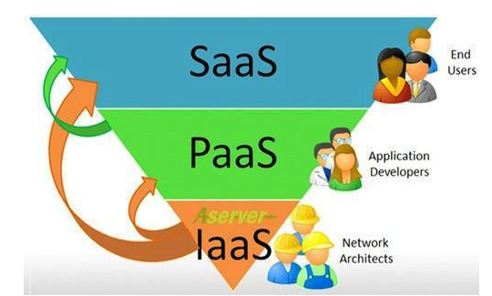

## 云端MYSQL

>  
>
> 
>
> **laas(基础设施即服务)**
>
> 采用租用方式使用服务器,存储,网络硬件等机器设备
>
> - 租赁
> - 自动服务
> - 动态缩放
>
> **Paas(平台即服务)**
>
> 提供**虚拟服务器**,**操作系统**,安全应用协助工具(k8s平台等),主要面向开发人员,推动Saas服务使用
>
> **Saas(软件即服务)**
>
> 支持互联网软件的服务
>
> **互联网软件服务**
>
> 1) 开发环境：PaaS基本都会给开发者提供一整套包括IDE在内的开发和测试环境，而IaaS方面用户主要还是沿用之前比较熟悉那套开发环境，但是因为之前那套开发环境在和云的整合方面比较欠缺，所以使用起来不是很方便。
>
> 2) 支持的应用：因为IaaS主要是提供虚拟机，而且普通的虚拟机能支持多种操作系统，所以IaaS支持的应用的范围是非常广泛的。但如果要让一个应用能跑在某个PaaS平台不是一件轻松的事，因为不仅需要确保这个应用是基于这个平台所支持的语言，而且也要确保这个应用只能调用这个平台所支持的API，如果这个应用调用了平台所不支持的API，那么就需要对这个应用进行修改。
>
> 3) 开放标准：虽然很多IaaS平台都存在一定的私有功能，但是由于OVF等协议的存在，使得IaaS在跨平台和避免被供应商锁定这两面是稳步前进的。而PaaS平台的情况则不容乐观，因为不论是Google的App Engine，还是Salesforce的Force.com都存在一定的私有API。
>
> 4) 可伸缩性：PaaS平台会自动调整资源来帮助运行于其上的应用更好地应对突发流量。而IaaS平台则需要开发人员手动对资源进行调整才能应对。
>
> 5) 整合率和经济性： PaaS平台整合率是非常高，比如PaaS的代表Google App Engine能在一台服务器上承载成千上万的应用，而普通的IaaS平台的整合率最多也不会超过100，而且普遍在10左右，使得IaaS的经济性不如PaaS。
>
> 6) 计费和监管：因为PaaS平台在计费和监管这两方面不仅达到了IaaS平台所能企及的操作系统层面，比如，CPU和内存的使用量等，而且还能做到应用层面，比如，应用的反应时间（Response Time）或者应用所消耗的事务多少等，这将提高计费和管理的精确性。
>
> 7) 学习难度：因为在IaaS上面开发和管理应用和现有的方式比较接近，而PaaS上面开发则有可能需要学一门新的语言或者新的框架，所以IaaS学习难度更低。
>
> **Dbaas(数据库即服务)**
>
> *向用户提供一个灵活的,可扩展的,按需服务的数据库平台*
>
> 
> TODO 未完成