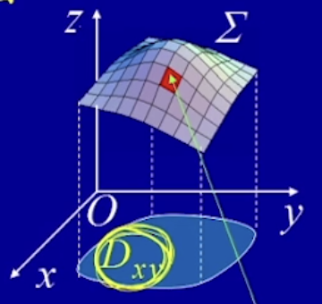
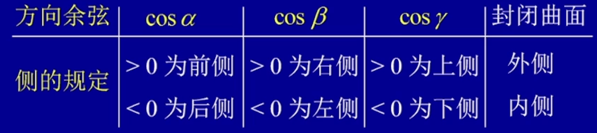

## 曲线积分与曲面积分

- 一重积分：在数轴的一个闭区间与函数所围成的面积（被积函数为平面曲线）
- 二重积分：在空间坐标系上函数与其投影所围成的空间体积（被积函数为空间曲面）
- 三重积分：在空间有界闭区域与其被积函数围成的密度或质量（通常四维空间使用密度或质量代替）
- 曲线积分：求给定曲线的弧长与被积函数值之和（被积函数自定义在弧长的值域之和）
- 对坐标曲线积分：曲线积分中被积分函数拆分为X方向P(x,y)，Y方向Q(x,y)函数被积函数
- 曲面积分：求给定曲面的范围与被积函数值之和（求解曲面的质量、体积、密度等物理量）
- 对坐标的曲线积分（第二类曲面积分）：曲面积分中被积分函数拆分为X方向P(x,y,z)，Y方向Q(x,y,z)函数，Z方向R(x,y,z)被积函数之和

#### **曲线积分**

> *设L为Oxy平面内一条曲线弧，端点为A,B，其被积分函数f(x,y)在L上有界，在L上定义n-1个点$M_1(x_1,y_1) ... M_n(x_n,y_n)，并取M_1=A,M_n=B$*则把L分为n+1小段其每段长度为 $\Delta s，L上任意一点与\Delta s做乘积的到 f(x_i,y_i)\Delta s_i$，并对i求和$\sum_{i=1}^nf(x_i,y_i)\Delta s_i$当最小弧长度趋近于0时，则f(x,y)和式极限存在，此函数在f(x,y)在曲线L上弧长的曲线积分 
> $$
> \int_Lf(x,y)ds = lim_{\lambda \to 0}\sum_{i=1}^{n}f(x_i,y_i)\Delta s_i \\\
> f(x,y) 被积函数(密度函数)，L为积分弧段，ds：被积曲线
> $$
>  
>
> L与曲面f(x,y)所围成的面积，或(x,y)在L上线质量密度f(x,y)
>
> 当曲线勾搭的线密度p(x,y)在曲线弧L上连续时，该构件质量为 $M=\int_Lp(x,y)ds$
>
> **曲线积分性质**
>
> - $\int_Lds =|L|$其中|L|表示曲线弧L长度
> - 其他同积分
>
> **曲线积分计算**
> $$
> 曲线参数方程L:\left\{
> 	\begin{array}{c}
> 	 x=\varphi(t)  \\
> 	 y= \psi(t) 
> 	\end{array}
> \right. ~~~ (a\le t \le b)  \\
> \int_Lf(x,y)ds = \int_a^bf(\psi(t),\phi(t))\sqrt{(\psi^`(t))^2 + (\varphi^`(t))^2 } dt \\
> 当参数方程为 x= t,y=\varphi(t)时： \\
> \int_Lf(x,y)ds = \int_a^bf(x,y(x)) \sqrt{1+(\frac{dy}{dx})^2}dx 
> $$
> 

#### **对坐标的曲线积分**

> 定义：*设L为Oxy平面从点A到点B的一条**有向**光滑曲线弧，函数P(x,y),Q(x,y)在L上有界，在L上沿L方向任意插入n-1个点$M_1(x_1.y_1)，M_2(x_2,y_2)，...M_i(x_i,y_i)$把L分为n段有向弧，设$\Delta x_i = x_i -x_{i-1}$，当各段弧长趋近于0时，和式$\sum_{i=1}^{n}P(x,y)\Delta x_i$ 极限存在，则函数P(x,y)在有向弧L上对x积分为$\int_LP(x,y)dx$，对y积分为$\int_LQ(x,y)dy$，P(x,y)，Q(x,y)叫做被积函数，L叫做积分弧段，二类曲线积分*
>
> 
>
> **对坐标的曲线积分计算**
> $$
> 参数方程L：\left\{
> 	\begin{array}{c}
> 		x=\psi(t),\\
> 		y=\varphi(t) 
> 	\end{array}
> \right. \\
> t: A \to B ~~~~ \\
> \int_{L_{AB}}P(x,y)dx + Q(x,y)dy = \int_a^b P(\psi(t),\varphi(t) )\psi(t)^`dt + \int Q(\psi(t),\varphi(t) )\varphi(t)^`dt
> $$
> 
>*一类曲线积分与二类曲线积分*
> 
>- *一类曲线积分：在弧上所有点与其距离乘积的累加$f(x_i,y_i)\Delta s_i，其中\Delta s_i代表L_i到L_{i-1}长度 化为\Delta x \Delta y 的方向增量为 \Delta s = \sqrt{\Delta^2x+\Delta^2y}$*
> 
>- *二类曲线积分：某点沿弧方向上向量作x轴y分解得到 $P(x,y)\Delta x + Q(x,y)\Delta y$*
> 
>- 一类曲线积分与二类曲线积分转换 
>   $$
>   P(x,y)\Delta x + Q(x,y)\Delta y = (P\frac{\Delta x}{\sqrt{\Delta^2x+\Delta^2y}} + Q\frac{\Delta y}{\sqrt{\Delta^2x+\Delta^2y}})\sqrt{\Delta^2x+\Delta^2y} \\
>   f(x_i,y_i)\cdot \sqrt{\Delta^2x+\Delta^2y} = Pcos\alpha + Qcos\beta
>   $$
> 

#### **格林公式**   *求闭合区域边界曲线的二重积分*

> *平面上沿闭曲线L对坐标的曲线积分与曲线L所围成闭区域D上的二重积分关系*
>
> 单连通区域：闭合曲线包含的全部区域
>
> 复连通区域：闭合曲线中存在不包含的区域
>
> 正方向：外界边逆时针，内界边顺时针
> $$
> 格林公式 :
> \iint_D (\frac{\partial Q}{\partial x} - \frac{\partial P}{\partial y})dxdy = \oint_LPdx +Qdy \\ 其中L为D的正方向边界曲线 \\
> \oint_LPdx +Qdy ： 为二类曲线积分
> $$
> **格林公式计算**
>
> - 通过曲线积分求D的二重积分
>
>   > 1. 带入格林公式直接计算二重积分
>
> - 通过二重积分求曲线积分
>
>   > 1. 设置未知变量积分求P，Q
>   > 2. 计算P，Q二类曲线积分
>
> 
>
> **平面曲线积分与路径无关条件**
>
> *当曲线L从A到B或从B到A的二类曲线积分相等，即$\int_{L_1}Pdx +Qdy = \int_{L_2}Pdx+Qdy = 0$，则曲线积分在D内与路径无关*
>
> **当$\int_LPdx+Qdy$在D内与路径无关的充要条件时其闭合曲线积分为0**
>
> 其格林公式必有 $\frac{\partial Q}{\partial x} = \frac{\partial P}{\partial y}$
>
> - 设开区域D为单连通区域，函数P(x,y)，Q(x,y)在D内具有连续的一阶偏导数，则P(x,y)dx+Q(x,y)dy在D内为某个**函数u(x,y)的全微分充要条件为** 
>   $$
>   \frac{\partial Q}{\partial x} = \frac{\partial P}{\partial y}
>   $$
>
> - d(x,y)=P(x,y)dx + Q(x,y)dy 
>
> 

#### **曲面积分**

> *被积分函数为三元积分*
> $$
> lim_{\lambda \to 0} \sum_{k=1}^{n}f(x,y,z) \Delta s = \iint_{\Sigma}f(x,y,z)dS \\
> 第一类曲面积分
> $$
> **曲面积分计算**
>
> $\Sigma =z(x,y),(x,y)\in D_{xy},f(x,y,z)$在$\Sigma$上连续，则曲面积分$\iint_{\Sigma}f(x,y,z)dS $存在，且有 
> $$
> \iint_{\Sigma}f(x,y,z)dS = \iint_{D_{xy}}f(x,y,z(x,y))\sqrt{1+z_x^2(x,y)+z_y^2(x,y)}dxdy
> $$
>  
>
> 1. 求空间曲面在xoy面上投影
> 2. 求三元曲面z关于x,y的隐函数 z(x,y)，并带入被积曲面积分
> 3. $ds = \sqrt{1+z_x^2(x,y)+z_y^2(x,y)}dxdy$
> 4. 求二重积分

#### **对坐标的曲面积分**

> 侧的方向
>
>  
>
> 其中 a 为曲面该点的法向量与x轴夹角，b为曲面法向量与y轴夹角，y为曲面法向量与z轴夹角
>
> 在$\Sigma$上定义一个向量场$\vec{A}=(P(x,y,z),Q(x,y,z),R(x,y,z))$，若对$\Sigma$的任意分割和在局部面上任意取点，下列极限都存在
> $$
> lim_{\lambda \to 0}\sum^{n}_{i=1}P(x,y,z)dydz + Q(x,y,z)dxdz +R(x,y,z)dydz \\
> \phi = \iint_{\Sigma}Pdydz + Qdzdx + Rdxdy
> $$

